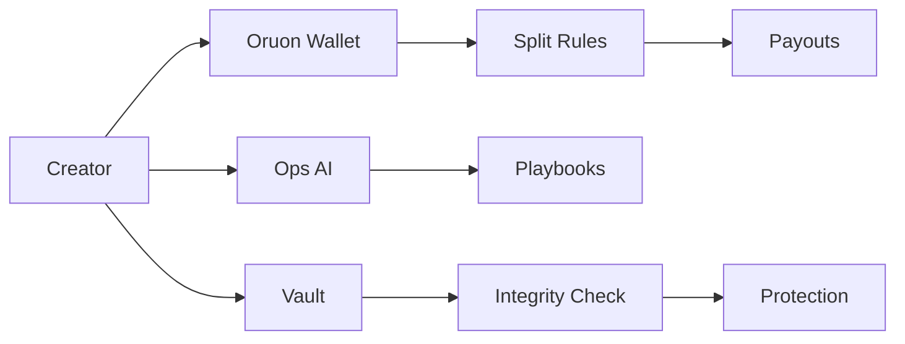
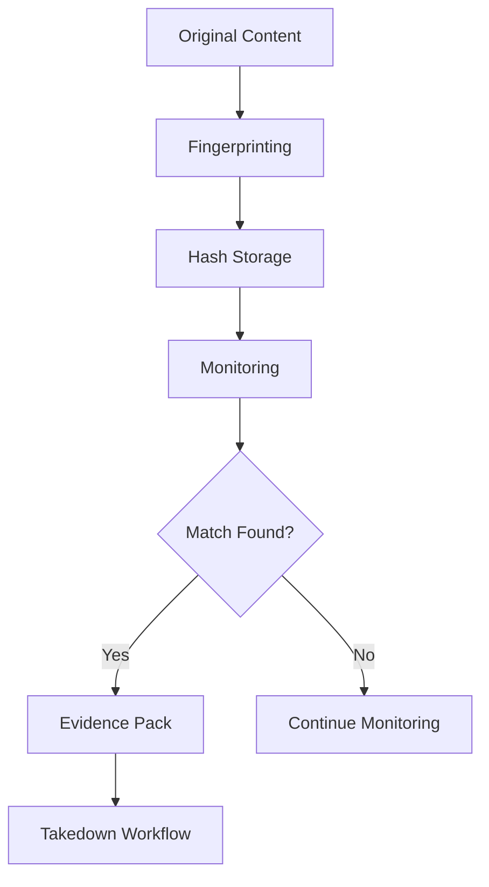

# Architecture & Integrations (High-Level)

<Warning>
We publish a **conceptual** view only; sensitive specifics are shared under NDA.
</Warning>

## Technology Stack

### Frontend & Orchestration

<CardGroup cols={2}>
  <Card title="Web Application" icon="window">
    **Next.js** deployed on Vercel for optimal performance and scalability
  </Card>
  <Card title="Messaging Integration" icon="message">
    **WhatsApp flows** for creator communication and operations
  </Card>
  <Card title="AI Operations" icon="robot">
    **Ops (Sasha)** for intelligent workflow automation
  </Card>
</CardGroup>

### Storage & Data

<CardGroup cols={2}>
  <Card title="Media Storage" icon="cloud">
    **Cloudflare R2** for secure media vault storage
  </Card>
  <Card title="Database" icon="database">
    **MongoDB** for metadata and configuration management
  </Card>
</CardGroup>

### AI & Automation

- **Azure AI services** for machine learning capabilities
- **Browser automation** for evidence gathering (proof of concept)
- **Model configurations** (non-hardcoded, flexible deployment)

### Wallet Infrastructure (Oruon)

- **Internal ledger** for balance management
- **Partner rails** for compliant payouts
- **Manteca.dev** in staging (Nov 2025)
  - Production cutover targeted after readiness checks

### Security Infrastructure

- **Secret vaults** for credential management
- **Access scoping** with role-based controls
- **Observability & alerts** for system monitoring

---

## Architecture Diagram

---

## Integration Status

### Current Integrations (Nov 2025)

<Tabs>
  <Tab title="Production">
    - WhatsApp Business API
    - Azure AI Services
    - Cloudflare R2
    - MongoDB Atlas
    - Vercel hosting
  </Tab>
  <Tab title="Staging">
    - **Manteca.dev** (wallet rails)
    - Advanced leak detection
    - Short-form video processing
  </Tab>
  <Tab title="Development">
    - Authenticity certificates
    - White-label API
    - Voice actions
  </Tab>
</Tabs>

---

## Data Flow

### Creator Workflow

### Integrity Pipeline

---

## Scalability & Performance

<AccordionGroup>
  <Accordion title="Horizontal Scaling">
    Microservices architecture enables independent scaling of components based on demand
  </Accordion>
  <Accordion title="Caching Strategy">
    Multi-layer caching (CDN, application, database) for optimal performance
  </Accordion>
  <Accordion title="Load Balancing">
    Intelligent traffic distribution across availability zones
  </Accordion>
  <Accordion title="Database Optimization">
    Sharding and indexing strategies for high-throughput operations
  </Accordion>
</AccordionGroup>

---

## Future Architecture Plans

<Steps>
  <Step title="Q1 2026">
    Manteca.dev production integration and wallet infrastructure improvements
  </Step>
  <Step title="Q2 2026">
    Enhanced FX routing and multi-currency optimization
  </Step>
  <Step title="H2 2026">
    Regional data centers and compliance infrastructure
  </Step>
</Steps>

<Info>
For detailed architecture discussions, technical specifications, and integration guides, please schedule a technical review call under NDA.
</Info>
