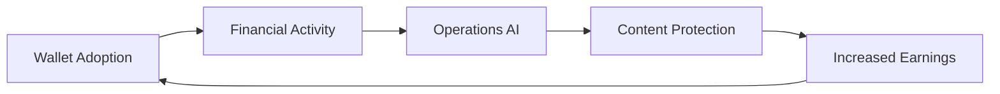

# Go-To-Market & Monetization

## Go-To-Market Motion

### Wallet-First Adoption Strategy

<Card title="Core Strategy" icon="bullseye">
  **Oruon** serves as the primary entry point, capturing value at the point of money. Ops and Vault then amplify retention and ARPU through daily execution and protection.
</Card>

### Growth Flywheel

### Acquisition Channels

<CardGroup cols={2}>
  <Card title="Direct Creator Outreach" icon="user-plus">
    Targeted campaigns to high-value creators
  </Card>
  <Card title="Community & Referrals" icon="users">
    Creator-to-creator network effects
  </Card>
  <Card title="Platform Partnerships" icon="handshake">
    Integrations with content platforms
  </Card>
  <Card title="Agency Relationships" icon="building">
    B2B channel through creator agencies
  </Card>
</CardGroup>

---

## Monetization Model

### Packaging Overview

<Tabs>
  <Tab title="Oruon (Wallet)">
    **Free Core Features:**
    - Basic wallet functionality
    - Standard payouts
    - Essential statements

    **Paid Premium:**
    - Advanced FX services
    - Complex split rules
    - Enhanced statements
    - Priority support
  </Tab>

  <Tab title="Ops (AI)">
    **Tiered Coaching:**
    - **Starter:** Basic playbooks and nudges
    - **Pro:** Advanced automation and smart replies
    - **Enterprise:** Custom playbooks and dedicated support
  </Tab>

  <Tab title="Vault (Protection)">
    **Creator Subscriptions:**
    - Individual creator plans
    - Storage tiers
    - Monitoring capacity

    **B2B Solutions:**
    - Dashboard and API access
    - White-label options
    - Agency/platform integrations
  </Tab>
</Tabs>

---

## Pricing Principles

<AccordionGroup>
  <Accordion title="No Dark Patterns">
    Clear value proposition with transparent pricing. No hidden fees or deceptive practices.
  </Accordion>

  <Accordion title="Ethical Lock-In">
    Retention through indispensable utility, not friction. Users stay because of value, not because it's hard to leave.
  </Accordion>

  <Accordion title="Value-Based Pricing">
    Pricing aligned with value delivered. As creators earn more, we grow together.
  </Accordion>

  <Accordion title="Stable Experimentation">
    Pricing experiments are announced publicly only when stable. No surprise changes.
  </Accordion>
</AccordionGroup>

---

## Market Positioning

### Competitive Differentiation

<CardGroup cols={2}>
  <Card title="System of Record" icon="database">
    We own the complete creator financial and operational history
  </Card>
  <Card title="Privacy-First" icon="shield">
    Built from the ground up with creator privacy and protection
  </Card>
  <Card title="AI-Powered Operations" icon="brain">
    Intelligent automation that actually increases earnings
  </Card>
  <Card title="Integrated Ecosystem" icon="puzzle-piece">
    Money, operations, and protection working together
  </Card>
</CardGroup>

### Target Segments

**Primary:** Independent content creators earning $1K-50K/month
- High need for financial infrastructure
- Significant protection concerns
- Operations complexity requiring AI assistance

**Secondary:** Creator agencies and platforms
- B2B white-label solutions
- API integrations
- Multi-creator management

**Future:** Emerging creators and micro-influencers
- Scaled-down entry products
- Growth-oriented tooling
- Community features

---

## Unit Economics

<Info>
Combined **SaaS + Fintech + Platform** model yields an **attractive blended margin**.

Key metrics:
- **Acquisition efficiency:** Single-digit cents per lead
- **~6× below** LATAM fintech peer averages
- **Meaningful share** of activated users monetize
- Strong retention driven by wallet habit loop
</Info>

<Card
  title="Request Detailed Economics"
  icon="chart-line"
  href="/investors/overview"
  horizontal
>
  Access full cohort economics, CAC/Payback, and ARPU trajectories under NDA
</Card>

---

## Revenue Streams

### Current Revenue Mix

<Steps>
  <Step title="Wallet Fees">
    Transaction fees, FX spreads, premium features
  </Step>
  <Step title="SaaS Subscriptions">
    Ops AI tiers, Vault protection plans
  </Step>
  <Step title="Platform Take Rate">
    Revenue share on facilitated transactions
  </Step>
</Steps>

### Future Revenue Opportunities

- **B2B licensing** for agencies and platforms
- **White-label solutions** for enterprise
- **API access** for developers and integrators
- **Premium features** as product suite expands

---

## Growth Targets

<Warning>
Specific growth targets, revenue projections, and detailed cohort performance are available under NDA for qualified investors.
</Warning>

### Public Milestones

- **Q4 2025:** Achieve production-ready wallet infrastructure
- **Q1 2026:** Launch B2B pilot programs
- **Q2 2026:** Expand to additional markets
- **H2 2026:** SOC 2 compliance and enterprise readiness

---

## Contact for Partnership Opportunities

For partnership, integration, or white-label inquiries:

**Email:** [partnerships@modelty.app](mailto:partnerships@modelty.app)

**Book a call:** [Schedule partnership discussion](https://cal.com/modelty/partnerships)
