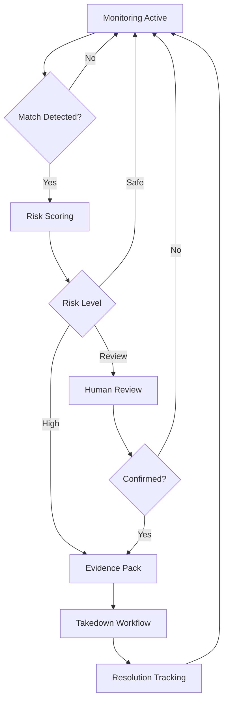

# RemoveMyContent — Vault & Takedowns (Private Beta)

**Protect what you earn.**

Private vault for canonical originals, perceptual hashes, suspected-leak matching, and evidence packs.

---

## Core Features

### Fingerprint & Matching

<CardGroup cols={2}>
  <Card title="Perceptual Hashing" icon="fingerprint">
    Content fingerprinting that survives crops, filters, and compression
  </Card>
  <Card title="Variant Detection" icon="clone">
    Identify modified versions of original content
  </Card>
  <Card title="Similarity Matching" icon="magnifying-glass">
    Find near-duplicates across the internet
  </Card>
  <Card title="Multi-Format Support" icon="file">
    Images, videos, and soon short-form video content
  </Card>
</CardGroup>

---

### Risk Scoring

<Tabs>
  <Tab title="Safe">
    **No action required**
    - Content is secure
    - No matches detected
    - Monitoring active
    - Green status indicator
  </Tab>

  <Tab title="Review">
    **Human review recommended**
    - Potential match detected
    - Similarity below threshold
    - Context needed
    - Yellow status indicator
  </Tab>

  <Tab title="High-Risk">
    **Immediate action required**
    - Clear match detected
    - Unauthorized distribution
    - Revenue impact likely
    - Red status indicator
  </Tab>
</Tabs>

### Audit Trail

Every content item and detection includes:
- **Timestamp** of upload and detection
- **Hash values** for integrity verification
- **Lineage tracking** from original to variants
- **Action history** of all takedown attempts
- **Outcome documentation** for enforcement

---

### Evidence Packs

<Steps>
  <Step title="Detection">
    System identifies unauthorized content
  </Step>
  <Step title="Evidence Collection">
    Automatically gathers proof of ownership and infringement
  </Step>
  <Step title="Package Generation">
    Creates comprehensive evidence pack with:
    - Original content proof
    - Timestamp documentation
    - Source links and screenshots
    - Hash comparisons
    - Ownership verification
  </Step>
  <Step title="Takedown Support">
    Ready-to-submit package for DMCA or platform takedown requests
  </Step>
</Steps>

---

## Responsible AI

### Privacy-First Approach

<Warning>
**Our commitments:**
- **Hash-first processing:** Content fingerprinting without storing full files when possible
- **No facial recognition** without explicit user consent
- **GDPR-aligned retention:** Data kept only as long as needed
- **Minimal data collection:** Only what's necessary for protection
- **User control:** Full data export and deletion capabilities
</Warning>

### Ethical Boundaries

<Accordion title="What We Do">
  - Perceptual hashing of user-uploaded content
  - Similarity matching for leak detection
  - Evidence gathering for authorized takedowns
  - Risk scoring based on match confidence
</Accordion>

<Accordion title="What We Don't Do">
  - Facial recognition without explicit consent
  - Indefinite data retention
  - Unauthorized content analysis
  - Third-party data selling
  - Invasive monitoring
</Accordion>

---

## Integration & Workflow

### Content Upload

<Steps>
  <Step title="Creator Uploads Original">
    Secure upload to private vault
  </Step>
  <Step title="Fingerprinting">
    Perceptual hash generated for matching
  </Step>
  <Step title="Monitoring Activation">
    Content added to active monitoring
  </Step>
  <Step title="Risk Baseline">
    Initial risk assessment completed
  </Step>
</Steps>

### Leak Detection

---

## Signal Integration

### Cross-Product Intelligence

<Tabs>
  <Tab title="To Oruon (Wallet)">
    **Financial impact signals:**
    - Leak detection → revenue protection urgency
    - Successful takedowns → ROI calculation
    - Content value → protection priority
    - Risk scoring → insurance/protection products
  </Tab>

  <Tab title="To Ops (AI)">
    **Action triggers:**
    - High-risk detection → immediate creator notification
    - Recurring leaks → strategy adjustment playbooks
    - Protection gaps → upload reminders
    - Successful enforcement → positive reinforcement
  </Tab>

  <Tab title="From User Behavior">
    **Context signals:**
    - Upload frequency → monitoring capacity
    - Content types → detection tuning
    - Response patterns → alert preferences
    - Enforcement history → takedown strategies
  </Tab>
</Tabs>

---

## Roadmap

### Q4 2025

<Steps>
  <Step title="Short-Form Video (Alpha)">
    TikTok, Reels, Shorts detection capabilities
  </Step>
  <Step title="Reviewer UI v1">
    Enhanced interface for human review workflow
  </Step>
  <Step title="Evidence Pack v2">
    Improved formatting and platform-specific templates
  </Step>
</Steps>

### Q1 2026

<Steps>
  <Step title="Read-Only Partner API">
    Allow platforms to query integrity status
  </Step>
  <Step title="Integrity Score Dashboard">
    Public-facing protection posture indicator
  </Step>
  <Step title="Bulk Upload">
    Library migration tools
  </Step>
</Steps>

### Q2 2026

<CardGroup cols={2}>
  <Card title="Pre-Publish Checks" icon="magnifying-glass">
    Verify content authenticity before distribution
  </Card>
  <Card title="Optional Watermarking" icon="image">
    Embed invisible ownership markers
  </Card>
  <Card title="Authenticity Certificates" icon="certificate">
    Hash-based proof of original creation
  </Card>
</CardGroup>

---

## Lock-In Factor

<Tip>
**High switching cost through:**

- **Fingerprinted library:** Re-fingerprinting entire catalog is time-intensive
- **Enforcement history:** Loss of takedown documentation and outcomes
- **Active monitoring:** Gaps during migration create vulnerability
- **Evidence packs:** Platform-specific formats and proven templates
- **Lineage tracking:** Difficult to recreate provenance elsewhere
</Tip>

---

## Pricing

### Creator Subscriptions

<Tabs>
  <Tab title="Basic">
    **Free with Oruon account**
    - 100 items monitored
    - Basic risk scoring
    - Manual evidence packs
    - Community support
  </Tab>

  <Tab title="Pro">
    **Monthly subscription**
    - 1,000 items monitored
    - Advanced risk scoring
    - Automated evidence packs
    - Priority support
    - Short-form video
  </Tab>

  <Tab title="Enterprise">
    **Custom pricing**
    - Unlimited monitoring
    - Custom detection tuning
    - API access
    - White-label option
    - Dedicated account manager
  </Tab>
</Tabs>

### B2B Solutions

- **Platform integrations:** API access for integrity checks
- **Agency dashboards:** Multi-creator management
- **White-label:** Branded protection for agencies/platforms

---

## Privacy & Compliance

### Data Handling

<Accordion title="What We Store">
  - Perceptual hashes (not full content when possible)
  - Upload metadata and timestamps
  - Detection matches and evidence
  - User-provided ownership information
  - Takedown requests and outcomes
</Accordion>

<Accordion title="Retention Policy">
  - Active content: Retained during monitoring period
  - Deleted content: Hashes removed per user request
  - Evidence: Retained for legal compliance periods
  - Audit logs: Maintained per regulatory requirements
</Accordion>

<Accordion title="User Rights">
  - Right to access all stored data
  - Right to delete content and hashes
  - Right to export evidence packs
  - Right to opt out of specific features
</Accordion>

### Consent Model

- **Explicit consent** for facial recognition features
- **Clear disclosure** of monitoring scope
- **Opt-in** for advanced detection
- **Granular controls** for feature activation

---

## Legal & Enforcement

<Warning>
**Important:** RemoveMyContent provides tools and evidence for content protection. We are **not** a law firm and do not provide legal advice.

Enforcement actions are the responsibility of the creator, and success depends on platform policies and applicable laws.
</Warning>

### Supported Actions

- **DMCA takedowns** (US-based platforms)
- **Platform-specific reports** (terms of service violations)
- **Evidence documentation** for legal proceedings
- **Workflow guidance** for enforcement process

### Success Factors

- **Quality of evidence:** Clear ownership and infringement proof
- **Platform responsiveness:** Varies by platform
- **Legal jurisdiction:** Different laws apply in different regions
- **Persistence:** Multiple attempts may be required

---

## Getting Started

<CardGroup cols={2}>
  <Card
    title="Request Beta Access"
    icon="flask"
    href="mailto:vault@modelty.app"
  >
    Join the private beta program
  </Card>
  <Card
    title="Documentation"
    icon="book"
    href="/resources/vault-guide"
  >
    Complete guide to content protection
  </Card>
</CardGroup>

<Info>
For investors: Detailed Vault metrics, detection performance, and takedown success rates are available under NDA. See [Investors section](/investors/overview).
</Info>
